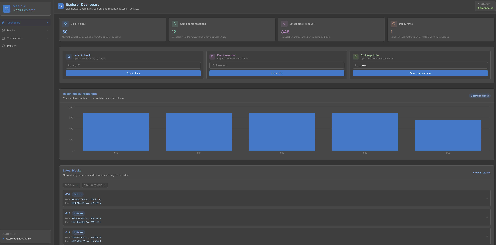
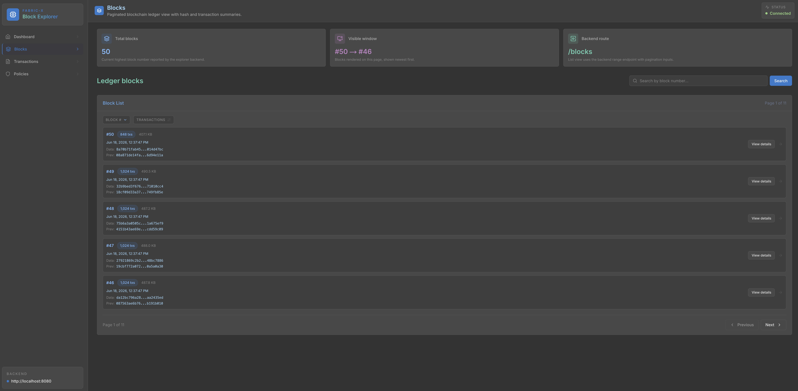
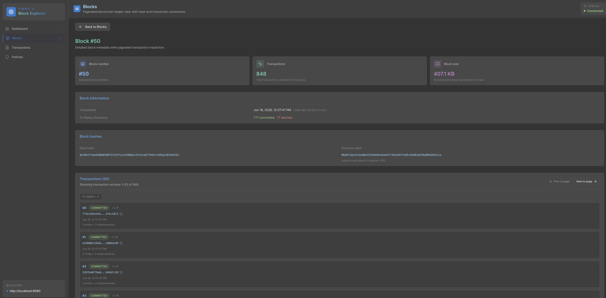
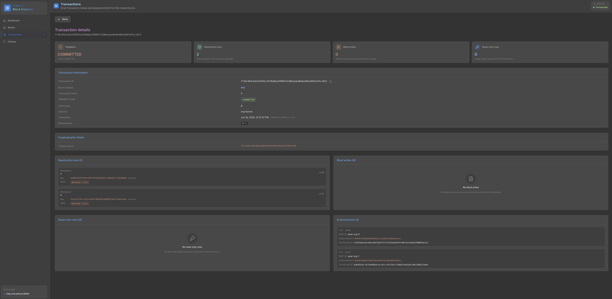
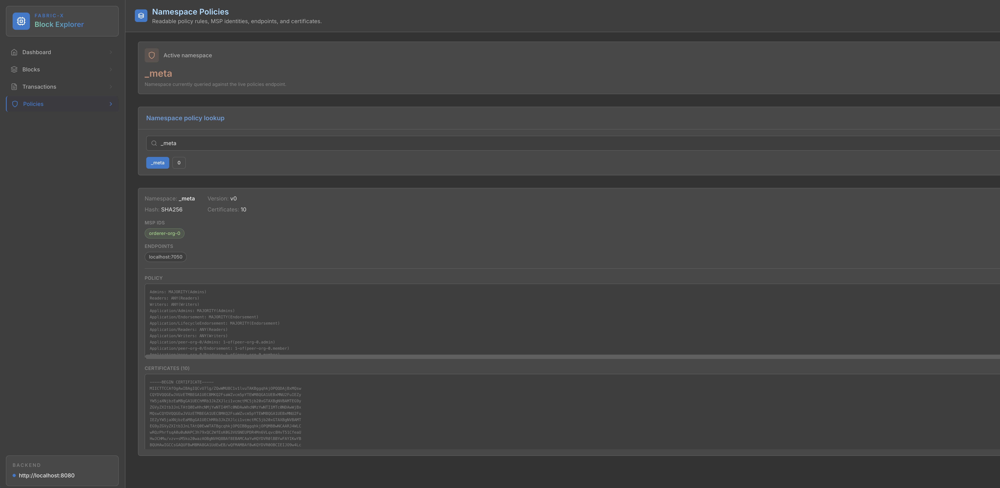

# Fabric-X Block Explorer

A lightweight block explorer for Hyperledger Fabric networks. It ingests blocks from a Fabric-X sidecar, writes indexed data into PostgreSQL, and exposes a REST API for querying blocks, transactions, and namespace policies. A Next.js web UI is included in the `ui/` directory.

```
┌─────────────────┐     gRPC      ┌──────────────────┐     SQL      ┌────────────┐
│  Fabric-X       │  ──────────►  │  Explorer        │  ─────────►  │ PostgreSQL │
│  Sidecar        │               │  (Go binary)     │  ◄─────────  │            │
└─────────────────┘               └────────┬─────────┘              └────────────┘
                                           │ REST :8080 / :18080
                                           ▼
                                  ┌──────────────────┐
                                  │  Next.js UI      │
                                  │  :3000           │
                                  └──────────────────┘
```

---

## Requirements

| Tool | Version | Purpose |
|---|---|---|
| Go | 1.26+ | Build the explorer binary |
| Node.js | 18+ | UI dev server / production build |
| npm | 9+ | UI package manager |
| Docker | 28+ | All container-based workflows |
| `docker-compose` or `docker compose` | v2 recommended | Docker Compose stack |
| `curl` + `python3` | any | REST smoke tests |
| `jq` | any | Self-contained live stack (`make dev`) |

---

## Option 1 — One-command local E2E (recommended for development)

Starts a **fully self-contained stack** — no external sidecar needed. Spins up:

- A **Fabric-X committer test node** (generates real blocks with load)
- A **PostgreSQL** instance
- The **explorer binary** (ingesting blocks via gRPC)
- The **Next.js UI dev server** (hot-reload)

```bash
make dev
```

Once everything is running:

| Service | URL |
|---|---|
| Explorer REST API | http://127.0.0.1:18080 |
| Swagger UI | http://127.0.0.1:18080/docs |
| UI | http://localhost:3000 |

To stop everything:

```bash
make dev-down
```

> **Note:** On first run `make dev` downloads the committer test-node Docker image
> (~500 MB) and runs `npm ci`. Subsequent runs are fast.

---

## Option 2 — Docker Compose (production-like, needs an external sidecar)

Runs the full stack (PostgreSQL + explorer + UI) in Docker containers. You must have a running Fabric-X sidecar reachable on your host machine (default port `4001`).

```bash
# Start postgres + explorer + UI
docker-compose up --build

# Services:
#   postgres  → localhost:5432
#   explorer  → http://localhost:8080   (REST API + Swagger at /docs)
#   ui        → http://localhost:3000

# Tear down
docker-compose down -v
```

The sidecar endpoint is set in `config.docker.yaml`. By default it points to `host.docker.internal:4001` (port 4001 on your host machine).

---

## Container Image

Two images are published as multi-arch (amd64 + arm64) to GHCR on pushes to `main` and release tags `vX.Y.Z` (see [.github/workflows/release.yaml](.github/workflows/release.yaml)).

```text
# Backend-only image
ghcr.io/lf-decentralized-trust-labs/fabric-x-block-explorer

# All-in-one image (PostgreSQL + backend + UI)
ghcr.io/lf-decentralized-trust-labs/fabric-x-block-explorer-allinone
```

| Tag | Meaning |
|---|---|
| `latest` | Tip of `main` |
| `vX.Y.Z` | Tagged release |
| `X.Y` | Latest patch of a minor release |
| `sha-<short>` | A specific commit |

### Which image should I use?

- `fabric-x-block-explorer`: backend-only (you provide PostgreSQL + sidecar + UI)
- `fabric-x-block-explorer-allinone`: **includes PostgreSQL + explorer backend + Next.js UI**

Both images still expect the **Fabric-X sidecar to be external**.

### One-command user experience (everything except sidecar)

If you want a single image where users just run one command and everything works (except sidecar), use:

```bash
docker pull ghcr.io/lf-decentralized-trust-labs/fabric-x-block-explorer-allinone:latest

docker run --rm \
  -p 3000:3000 \
  -p 8080:8080 \
  --add-host=host.docker.internal:host-gateway \
  -e SIDECAR_HOST=host.docker.internal \
  -e SIDECAR_PORT=4001 \
  ghcr.io/lf-decentralized-trust-labs/fabric-x-block-explorer-allinone:latest
```

Access:

- UI: `http://localhost:3000`
- Backend API: `http://localhost:8080`
- Backend health: `http://localhost:8080/healthz`

### Use sidecar on any host/port

Set these environment variables on the all-in-one image:

- `SIDECAR_HOST` (default `host.docker.internal`)
- `SIDECAR_PORT` (default `4001`)
- `SIDECAR_TLS_MODE` (default `none`)

Example:

```bash
docker run --rm \
  -p 3000:3000 \
  -p 8080:8080 \
  --add-host=host.docker.internal:host-gateway \
  -e SIDECAR_HOST=10.10.10.25 \
  -e SIDECAR_PORT=5001 \
  -e SIDECAR_TLS_MODE=none \
  ghcr.io/lf-decentralized-trust-labs/fabric-x-block-explorer-allinone:latest
```

### Build and smoke-test locally

```bash
# Backend-only image
make docker-build
make docker-smoke

# All-in-one image
make docker-build-allinone
make docker-smoke-allinone
```

---

## Option 3 — Manual local setup (each component separately)

Use this if you want full control, or are running your own Fabric-X sidecar.

### Step 1 — Build the explorer binary

```bash
make build
# Binary → ./bin/explorer
```

### Step 2 — Start PostgreSQL

```bash
make start-db
# Starts postgres in Docker on port 5433
```

### Step 3 — Start the explorer backend

`config.local.yaml` is pre-configured for local dev (postgres on `:5433`, sidecar on `:4001`):

```bash
go run ./cmd/explorer start --config config.local.yaml
# REST API → http://127.0.0.1:8080
# Swagger  → http://127.0.0.1:8080/docs
```

### Step 4 — Start the UI

```bash
make ui-install                                    # npm ci inside ui/ (first time only)
BACKEND_URL=http://127.0.0.1:8080 make ui-dev     # Next.js dev server with hot-reload
# UI → http://localhost:3000
```

`BACKEND_URL` is used **only at server startup** to configure the Next.js API proxy. The browser never contacts the backend directly — all `/api/*` requests are proxied through Next.js.

---

## Configuration Reference

The explorer reads a YAML config file passed via `--config`. See `config.local.yaml` for a fully annotated example.

### `database`

| Field | Default | Description |
|---|---|---|
| `endpoints[]` | — | PostgreSQL `host:port` list |
| `user`, `password`, `dbname` | — | Connection credentials |
| `max_conns` | `20` | Connection pool size |
| `max_conn_idle_time` | — | Pool eviction idle duration |
| `max_conn_lifetime` | — | Pool eviction lifetime duration |
| `retry` | — | Exponential back-off for initial connection |
| `tls` | — | PostgreSQL TLS settings |

### `sidecar`

| Field | Default | Description |
|---|---|---|
| `connection.endpoint` | — | Fabric-X sidecar `host:port` |
| `connection.tls.mode` | `none` | `none`, `tls` (server-auth), or `mtls` (mutual TLS) |
| `connection.tls.ca-cert-paths[]` | — | CA certificate(s) — required for `tls` / `mtls` |
| `connection.tls.cert-path` | — | Client certificate — `mtls` only |
| `connection.tls.key-path` | — | Client private key — `mtls` only |
| `start_block` | `0` | First block number to stream from |

### `buffer`

| Field | Default | Description |
|---|---|---|
| `raw_channel_size` | `500` | Raw-block channel capacity (receiver → processor) |
| `proc_channel_size` | `500` | Processed-block channel capacity (processor → writer) |

### `workers`

| Field | Default | Description |
|---|---|---|
| `processor_count` | `4` | Parallel block processor goroutines |
| `writer_count` | `4` | Parallel DB writer goroutines |

### `server.rest`

| Field | Default | Description |
|---|---|---|
| `endpoint` | `127.0.0.1:8080` | REST bind address |
| `read_header_timeout` | `10s` | Max time to read request headers |
| `read_timeout` | — | Max time to read the full request |
| `write_timeout` | — | Max time to write a response |
| `shutdown_timeout` | — | Graceful shutdown drain time |
| `default_tx_limit` | `50` | Default page size for transactions in block responses |

---

## REST API

All responses are JSON. CORS is enabled (`Access-Control-Allow-Origin: *`). Interactive Swagger UI and the raw OpenAPI spec are always available.

| Method | Path | Description |
|---|---|---|
| `GET` | `/healthz` | Liveness probe — returns `{"status":"ok"}` instantly, no DB call |
| `GET` | `/blocks/height` | Current block height |
| `GET` | `/blocks` | Paginated block summaries (`offset`, `limit`) |
| `GET` | `/blocks/{block_num}` | Block detail with embedded transactions |
| `GET` | `/transactions/{tx_id}` | Transaction detail by hex tx ID |
| `GET` | `/namespaces/policies` | Latest policy for every namespace |
| `GET` | `/namespaces/{namespace}/policies` | All policy versions for a specific namespace |
| `GET` | `/openapi.yaml` | OpenAPI 3.0 specification |
| `GET` | `/docs` | Interactive Swagger UI |

---

## Web UI

Next.js 14 app (App Router, TypeScript, Tailwind CSS) in the `ui/` directory.

### Pages

| Route | Description |
|---|---|
| `/` | Dashboard — block height, tx throughput chart, recent blocks, search |
| `/blocks` | Paginated block list with sortable columns |
| `/blocks/{num}` | Block detail — metadata, hashes, tx status summary, paginated tx list |
| `/transactions/{id}` | Transaction detail — read/write sets, blind writes, endorsements, crypto fields |
| `/policies` | Namespace policy explorer with human-readable decoded rules |

### Screenshots

| Dashboard | Block list |
|---|---|
|  |  |

| Block detail | Transaction detail |
|---|---|
|  |  |

| Policies |
|---|
|  |

### Hex Decoding

Keys and values in Fabric read-write sets are raw bytes hex-encoded by the backend. The UI auto-decodes them in priority order:

1. **JSON** — collapsible, syntax-highlighted JSON tree
2. **UTF-8 text** — rendered as a readable string
3. **Binary** — truncated hex with an expand/collapse toggle

---

## Make Targets

```text
make help              # Print all targets

# ── One-command E2E ──────────────────────────────────────────────
make dev               # 🚀 Build + committer/postgres/explorer + UI dev server
make dev-down          # 🛑 Tear down everything started by make dev

# ── Building ─────────────────────────────────────────────────────
make build             # Build ./bin/explorer
make docker-build      # Build the explorer Docker image
make docker-smoke      # Build the image + run a container smoke test
make docker-build-allinone  # Build all-in-one image (postgres + backend + ui)
make docker-smoke-allinone  # Build all-in-one image + run readiness smoke test

# ── Testing ──────────────────────────────────────────────────────
make test-no-db        # Tests that don't need a database
make test-requires-db  # DB tests (auto-starts postgres)
make test-all          # All unit tests
make test-integration  # Integration tests (live committer + postgres)
make coverage          # HTML coverage report → coverage/coverage.html

# ── Database ─────────────────────────────────────────────────────
make start-db          # Start postgres container on port 5433
make ensure-db         # Start postgres if not running; create 'explorer' DB
make stop-db           # Remove the test postgres container

# ── Docker Compose ───────────────────────────────────────────────
make run               # Start postgres + explorer + UI (external sidecar needed)
make run-down          # Stop and remove the stack

# ── Self-contained smoke tests ────────────────────────────────────
make swagger           # Full stack + smoke tests + open Swagger UI
make live-stop         # Tear down the stack started by make swagger
make smoke-rest        # Call all REST endpoints and fail on bad responses
make smoke-live        # Recreate stack + smoke-rest in one shot

# ── UI ───────────────────────────────────────────────────────────
make ui-install        # npm ci inside ui/
make ui-dev            # Start UI dev server (backend must be on :8080)
make ui-build          # Production build
make ui-lint           # Lint UI source

# ── Code generation & lint ────────────────────────────────────────
make sqlc              # Regenerate Go code from SQL
make check-sqlc        # Fail if generated SQLC code is out of sync
make lint              # Run golangci-lint
```

---

## Project Structure

```text
.
├── cmd/
│   └── explorer/           # Binary entry point (cobra CLI: start, version)
├── pkg/
│   ├── api/                # REST server, OpenAPI spec, policy decoder/renderer
│   ├── blockpipeline/      # Receiver → processor → writer pipeline
│   ├── cli/                # Cobra command definitions
│   ├── config/             # YAML config loader and defaults
│   ├── db/                 # PostgreSQL pool, schema migrations, sqlc queries
│   │   ├── migrations/     # SQL migration files
│   │   ├── queries/        # Raw SQL query files (input to sqlc)
│   │   └── sqlc/           # sqlc-generated Go code (do not edit manually)
│   ├── parser/             # Fabric envelope parser (protobuf decode)
│   ├── sidecarstream/      # gRPC block-stream client wrapping delivercommitter
│   ├── types/              # Shared domain types (ProcessedBlock, etc.)
│   └── util/               # Helpers (nullable, ptr)
├── ui/                     # Next.js 14 web interface
│   ├── app/                # App Router pages (/, /blocks, /transactions, /policies)
│   ├── components/
│   │   ├── explorer/       # Domain components: MetricCard, HexField, HashValue, EmptyState
│   │   └── ui/             # Generic components: Button, Badge, Card, Loading, SearchInput
│   ├── lib/
│   │   ├── api.ts          # Typed REST client + response transform layer
│   │   ├── policyDecoder.ts# Human-readable policy rule decoder
│   │   └── utils.ts        # Hex decode, formatting, validation code helpers
│   └── Dockerfile          # Multi-stage Next.js production image
├── scripts/
│   └── test-live.sh        # Self-contained live stack script (used by make dev / make swagger)
├── config.local.yaml       # Config for local dev (postgres :5433, sidecar :4001)
├── config.docker.yaml      # Config for Docker Compose stack (sidecar via host.docker.internal)
├── docker-compose.yaml     # Stack: postgres + explorer + ui
├── Dockerfile              # Multi-stage explorer binary image
├── Makefile
└── sqlc.yaml               # sqlc codegen configuration
```
