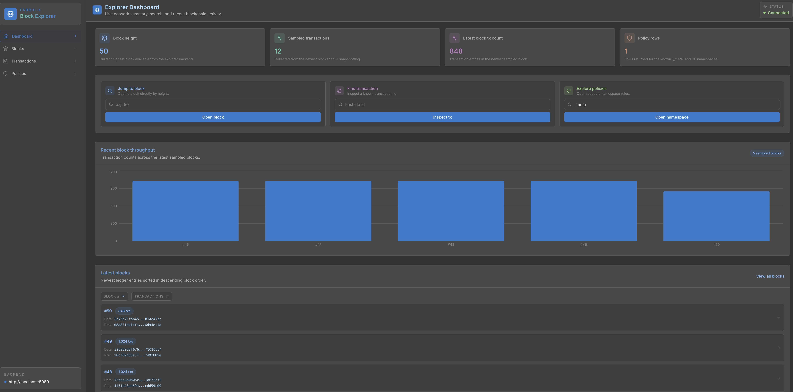
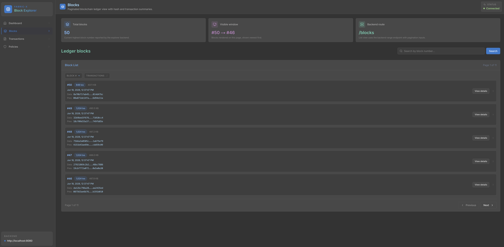
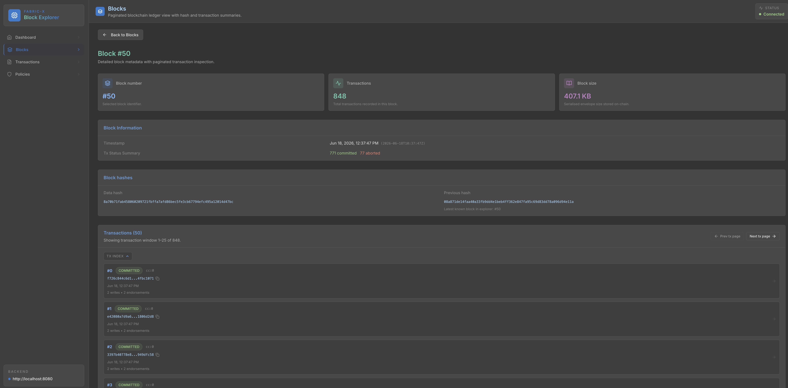
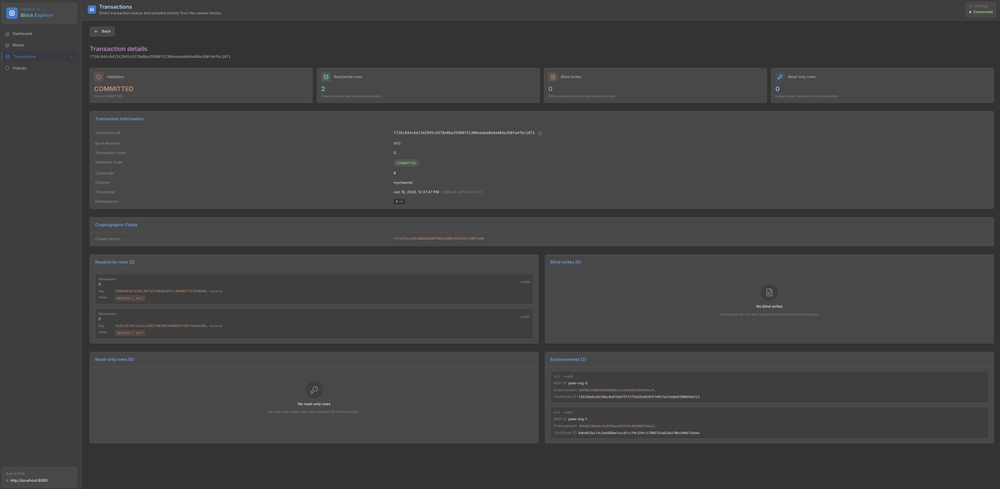
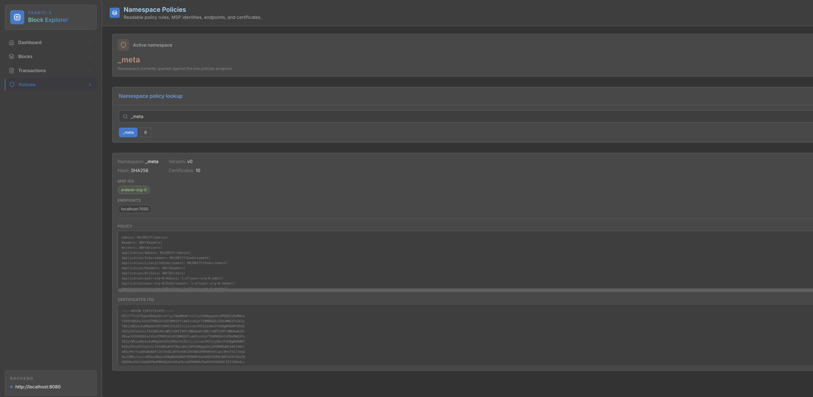

# Fabric-X Block Explorer

A lightweight block explorer for Hyperledger Fabric networks. It ingests blocks from a Fabric-X sidecar, writes indexed data into PostgreSQL, and exposes a REST API for querying blocks, transactions, and namespace policies. A Next.js web UI is included in the `ui/` directory.

```
┌─────────────────┐     gRPC      ┌──────────────────┐     SQL      ┌────────────┐
│  Fabric-X       │  ──────────►  │  Explorer        │  ─────────►  │ PostgreSQL │
│  Sidecar        │               │  (Go binary)     │  ◄─────────  │            │
└─────────────────┘               └────────┬─────────┘              └────────────┘
                                           │ REST :8080 / :18080
                                           ▼
                                  ┌──────────────────┐
                                  │  Next.js UI      │
                                  │  :3000           │
                                  └──────────────────┘
```

---

## Contributing and Security

- **Contributing** — see [`CONTRIBUTING.md`](CONTRIBUTING.md) for DCO sign-off requirements, branch naming, how to run tests, and the code-review process.
- **Security** — see [`SECURITY.md`](SECURITY.md) for the responsible disclosure policy. Do not open public issues for vulnerabilities.

---

## Quick Start

Run the full stack (PostgreSQL + combined explorer image) with no source code required:

```bash
# 1. Download the compose file and the sample config
curl -fsSL https://raw.githubusercontent.com/LF-Decentralized-Trust-labs/fabric-x-block-explorer/main/docker-compose.yaml \
  -o docker-compose.yaml
curl -fsSL https://raw.githubusercontent.com/LF-Decentralized-Trust-labs/fabric-x-block-explorer/main/config.docker.yaml \
  -o config.docker.yaml

# 2. (Optional) Edit config.docker.yaml to point at your sidecar host/port
#    Default: sidecar on host.docker.internal:4001

# 3. Start both services — images are pulled automatically from Docker Hub / GHCR
docker compose up -d
```

| Service | URL |
|---|---|
| UI | http://localhost:3000 |
| REST API | http://localhost:8080 |
| Swagger | http://localhost:8080/docs |

See **[Option 2 — Docker Compose](#option-2--docker-compose-recommended-for-production-like-deployment)** for full details, environment variables, and data persistence.

---

## Docker Images

One combined image is published to **Docker Hub** and the **GitHub Container Registry (GHCR)** on every release tag (`v*`):

| Image | Registry | Tags | Contents | Platforms |
|---|---|---|---|---|
| `fabric-x-block-explorer` | `docker.io/hyperledger` / `ghcr.io/lf-decentralized-trust-labs` | `:<version>` `:latest` | Go backend (:8080) + Next.js UI (:3000) | `linux/amd64`, `linux/arm64` |

The database uses the official `postgres:16-alpine` image — the project does
not ship a custom database image.

---

## Versioning

This project follows [Semantic Versioning](https://semver.org/) (`MAJOR.MINOR.PATCH`).
The canonical version is tracked in the [`VERSION`](VERSION) file at the repository root.

### Release tags

| Tag | Meaning |
|---|---|
| `v0.1.0` | Immutable release tag — always points to the exact release commit |
| `latest` | Floating tag — updated on every release tag |

Always **pin to a specific version tag** in production:

```yaml
# docker-compose.yaml — production-safe pin (Docker Hub)
image: docker.io/hyperledger/fabric-x-block-explorer:0.1.0
# or equivalently via GHCR:
# image: ghcr.io/lf-decentralized-trust-labs/fabric-x-block-explorer:0.1.0
```

Using `:latest` in production means you will automatically pick up every release,
including potentially breaking changes.

### How a release is cut

1. Update [`VERSION`](VERSION) to the new version (e.g. `0.2.0`).
2. Open and merge a PR with that change.
3. Create and push a Git tag matching the version: `git tag v0.2.0 && git push origin v0.2.0`.
4. The [`docker-release`](.github/workflows/docker-release.yml) workflow triggers on the tag,
   cross-compiles the Go binary for `linux/amd64`, `linux/arm64` via
   `make build-release`, then builds and pushes the combined image tagged `:<version>` and `:latest`
   to Docker Hub and GHCR.

---

## Requirements

| Tool | Version | Purpose |
|---|---|---|
| Go | 1.26+ | Build the explorer binary |
| Node.js | 18+ | UI dev server / production build |
| npm | 9+ | UI package manager |
| Docker | 28+ | All container-based workflows |
| `docker-compose` or `docker compose` | v2 recommended | Docker Compose stack |
| `curl` + `python3` | any | REST smoke tests (`make smoke-rest`) |

---

## Option 1 — One-command local E2E (recommended for development)

Starts a **fully self-contained stack** — no external sidecar needed. Spins up:

- A **Fabric-X committer test node** (generates real blocks with load)
- A **PostgreSQL** instance
- The **explorer binary** (ingesting blocks via gRPC)
- The **Next.js UI dev server** (hot-reload)

```bash
make dev
```

Once everything is running:

| Service | URL |
|---|---|
| Explorer REST API | http://127.0.0.1:18080 |
| Swagger UI | http://127.0.0.1:18080/docs |
| UI | http://localhost:3000 |

To stop everything:

```bash
make dev-down
```

> **Note:** On first run `make dev` downloads the committer test-node Docker image
> (~500 MB) and runs `npm ci`. Subsequent runs are fast.

---

## Option 2 — Docker Compose (recommended for production-like deployment)

Runs **PostgreSQL + Explorer** (backend + UI combined) as two containers using
the published image from GHCR. No source code required. The database uses the
official `postgres:16-alpine` image.

You must have a running Fabric-X sidecar reachable on your host machine
(default port `4001`).

### Quick start (no source code needed)

```bash
# 1. Download the compose file and the sample config
curl -fsSL https://raw.githubusercontent.com/LF-Decentralized-Trust-labs/fabric-x-block-explorer/main/docker-compose.yaml \
  -o docker-compose.yaml
curl -fsSL https://raw.githubusercontent.com/LF-Decentralized-Trust-labs/fabric-x-block-explorer/main/config.docker.yaml \
  -o config.docker.yaml

# 2. (Optional) Edit config.docker.yaml — set your sidecar address, credentials, etc.
#    The defaults assume your sidecar runs on host.docker.internal:4001.

# 3. Start both services (image pulled automatically from GHCR)
docker compose up -d

# Services:
#   postgres  → localhost:5432
#   explorer  → http://localhost:8080   (REST API + Swagger at /docs)
#              http://localhost:3000    (UI)

# Tear down (keeps data)
docker compose down

# Tear down and remove volumes (deletes all data)
docker compose down -v
```

The sidecar endpoint defaults to `host.docker.internal:4001`. Override it in
`config.docker.yaml` or via environment variables.

### Environment Variables

The Docker Compose stack supports environment variables for configuration. Copy `.env.example` to `.env` and customize:

```bash
cp .env.example .env
```

Available variables:

| Variable | Default | Description |
|---|---|---|
| `POSTGRES_USER` | `postgres` | PostgreSQL username |
| `POSTGRES_PASSWORD` | `postgres` | PostgreSQL password |
| `POSTGRES_DB` | `explorer` | PostgreSQL database name |
| `POSTGRES_PORT` | `5432` | PostgreSQL host port |
| `EXPLORER_PORT` | `8080` | Explorer REST API host port |
| `UI_PORT` | `3000` | UI host port |
| `NEXT_PUBLIC_BACKEND_DISPLAY_URL` | `http://localhost:8080` | Backend URL displayed in browser |

### Data Persistence

PostgreSQL data is persisted in a Docker volume named `postgres_data`. This ensures your blockchain data survives container restarts and removals.

```bash
# List volumes
docker volume ls

# Inspect the postgres volume
docker volume inspect fabric-x-block-explorer_postgres_data

# Backup the volume
docker run --rm -v fabric-x-block-explorer_postgres_data:/data -v $(pwd):/backup alpine tar czf /backup/postgres-backup.tar.gz -C /data .

# Restore from backup
docker run --rm -v fabric-x-block-explorer_postgres_data:/data -v $(pwd):/backup alpine tar xzf /backup/postgres-backup.tar.gz -C /data
```

### Resource Limits

The stack includes resource limits to prevent runaway containers:

| Service | CPU Limit | Memory Limit | CPU Reservation | Memory Reservation |
|---|---|---|---|---|
| postgres | 1 core | 512 MB | 0.5 core | 256 MB |
| explorer | 2 cores | 1.5 GB | 0.75 core | 768 MB |

Adjust these in `docker-compose.yaml` under `deploy.resources` if needed.

---

## Option 3 — Manual local setup (each component separately)

Use this if you want full control, or are running your own Fabric-X sidecar.

### Step 1 — Build the explorer binary

```bash
make build
# Binary → ./bin/explorer
```

### Step 2 — Start PostgreSQL

```bash
make start-db
# Starts postgres in Docker on port 5433
```

### Step 3 — Start the explorer backend

`config.local.yaml` is pre-configured for local dev (postgres on `:5433`, sidecar on `:4001`):

```bash
go run ./cmd/explorer start --config config.local.yaml
# REST API → http://127.0.0.1:8080
# Swagger  → http://127.0.0.1:8080/docs
```

### Step 4 — Start the UI

```bash
make ui-install                                    # npm ci inside ui/ (first time only)
BACKEND_URL=http://127.0.0.1:8080 make ui-dev     # Next.js dev server with hot-reload
# UI → http://localhost:3000
```

`BACKEND_URL` is used **only at server startup** to configure the Next.js API proxy. The browser never contacts the backend directly — all `/api/*` requests are proxied through Next.js.

---

## Configuration Reference

The explorer reads a YAML config file passed via `--config`. See `config.local.yaml` for a fully annotated example.

### `database`

| Field | Default | Description |
|---|---|---|
| `endpoints[]` | — | PostgreSQL `host:port` list |
| `user`, `password`, `dbname` | — | Connection credentials |
| `max_conns` | `20` | Connection pool size |
| `max_conn_idle_time` | — | Pool eviction idle duration |
| `max_conn_lifetime` | — | Pool eviction lifetime duration |
| `retry` | — | Exponential back-off for initial connection |
| `tls` | — | PostgreSQL TLS settings |

### `sidecar`

| Field | Default | Description |
|---|---|---|
| `connection.endpoint` | — | Fabric-X sidecar `host:port` |
| `connection.tls.mode` | `none` | `none`, `tls` (server-auth), or `mtls` (mutual TLS) |
| `connection.tls.ca-cert-paths[]` | — | CA certificate(s) — required for `tls` / `mtls` |
| `connection.tls.cert-path` | — | Client certificate — `mtls` only |
| `connection.tls.key-path` | — | Client private key — `mtls` only |
| `start_block` | `0` | First block number to stream from |

### `buffer`

| Field | Default | Description |
|---|---|---|
| `raw_channel_size` | `500` | Raw-block channel capacity (receiver → processor) |
| `proc_channel_size` | `500` | Processed-block channel capacity (processor → writer) |

### `workers`

| Field | Default | Description |
|---|---|---|
| `processor_count` | `4` | Parallel block processor goroutines |
| `writer_count` | `4` | Parallel DB writer goroutines |

### `server.rest`

| Field | Default | Description |
|---|---|---|
| `endpoint` | `127.0.0.1:8080` | REST bind address |
| `read_header_timeout` | `10s` | Max time to read request headers |
| `read_timeout` | — | Max time to read the full request |
| `write_timeout` | — | Max time to write a response |
| `shutdown_timeout` | — | Graceful shutdown drain time |
| `default_tx_limit` | `50` | Default page size for transactions in block responses |

---

## REST API

All responses are JSON. CORS is enabled (`Access-Control-Allow-Origin: *`). Interactive Swagger UI and the raw OpenAPI spec are always available.

| Method | Path | Description |
|---|---|---|
| `GET` | `/healthz` | Liveness probe — returns `{"status":"ok"}` instantly, no DB call |
| `GET` | `/blocks/height` | Current block height |
| `GET` | `/blocks` | Paginated block summaries (`offset`, `limit`) |
| `GET` | `/blocks/{block_num}` | Block detail with embedded transactions |
| `GET` | `/transactions/{tx_id}` | Transaction detail by hex tx ID |
| `GET` | `/namespaces/policies` | Latest policy for every namespace |
| `GET` | `/namespaces/{namespace}/policies` | All policy versions for a specific namespace |
| `GET` | `/openapi.yaml` | OpenAPI 3.0 specification |
| `GET` | `/docs` | Interactive Swagger UI |

---

## Web UI

Next.js 14 app (App Router, TypeScript, Tailwind CSS) in the `ui/` directory.

### Pages

| Route | Description |
|---|---|
| `/` | Dashboard — block height, tx throughput chart, recent blocks, search |
| `/blocks` | Paginated block list with sortable columns |
| `/blocks/{num}` | Block detail — metadata, hashes, tx status summary, paginated tx list |
| `/transactions/{id}` | Transaction detail — read/write sets, blind writes, endorsements, crypto fields |
| `/policies` | Namespace policy explorer with human-readable decoded rules |

### Screenshots

| Dashboard | Block list |
|---|---|
|  |  |

| Block detail | Transaction detail |
|---|---|
|  |  |

| Policies |
|---|
|  |

### Hex Decoding

Keys and values in Fabric read-write sets are raw bytes hex-encoded by the backend. The UI auto-decodes them in priority order:

1. **JSON** — collapsible, syntax-highlighted JSON tree
2. **UTF-8 text** — rendered as a readable string
3. **Binary** — truncated hex with an expand/collapse toggle

---

## Make Targets

```
make help              # Print all targets

# ── One-command E2E ──────────────────────────────────────────────
make dev               # 🚀 Build + committer/postgres/explorer + UI dev server
make dev-down          # 🛑 Tear down everything started by make dev

# ── Building ─────────────────────────────────────────────────────
make build             # Build ./bin/explorer
make build-release     # Cross-compile for linux/amd64, linux/arm64 (used by CI release)

# ── Testing ──────────────────────────────────────────────────────
make test-no-db        # Tests that don't need a database
make test-requires-db  # DB tests (auto-starts postgres)
make test-all          # All unit tests
make test-integration  # Integration tests (live committer + postgres)
make coverage          # HTML coverage report → coverage/coverage.html

# ── Database ─────────────────────────────────────────────────────
make start-db          # Start postgres container on port 5433
make ensure-db         # Start postgres if not running; create 'explorer' DB
make stop-db           # Remove the test postgres container

# ── Docker Compose ───────────────────────────────────────────────
make run               # Start postgres + explorer + UI (external sidecar needed)
make run-down          # Stop and remove the stack

# ── Self-contained smoke tests ────────────────────────────────────
make swagger           # Full stack + smoke tests + open Swagger UI
make live-stop         # Tear down the stack started by make swagger
make smoke-rest        # Call all REST endpoints and fail on bad responses
make smoke-live        # Recreate stack + smoke-rest in one shot

# ── UI ───────────────────────────────────────────────────────────
make ui-install        # npm ci inside ui/
make ui-dev            # Start UI dev server (backend must be on :8080)
make ui-build          # Production build
make ui-lint           # Lint UI source

# ── Code generation & lint ────────────────────────────────────────
make sqlc              # Regenerate Go code from SQL
make check-sqlc        # Fail if generated SQLC code is out of sync
make lint              # Run golangci-lint
```

---

## Project Structure

```
.
├── cmd/
│   └── explorer/           # Binary entry point (cobra CLI: start, version)
├── pkg/
│   ├── api/                # REST server, OpenAPI spec, policy decoder/renderer
│   ├── blockpipeline/      # Receiver → processor → writer pipeline
│   ├── cli/                # Cobra command definitions
│   ├── config/             # YAML config loader and defaults
│   ├── db/                 # PostgreSQL pool, schema migrations, sqlc queries
│   │   ├── migrations/     # SQL migration files
│   │   ├── queries/        # Raw SQL query files (input to sqlc)
│   │   └── sqlc/           # sqlc-generated Go code (do not edit manually)
│   ├── parser/             # Fabric envelope parser (protobuf decode)
│   ├── sidecarstream/      # gRPC block-stream client wrapping delivercommitter
│   ├── types/              # Shared domain types (ProcessedBlock, etc.)
│   └── util/               # Helpers (nullable, ptr)
├── ui/                     # Next.js 14 web interface
│   ├── app/                # App Router pages (/, /blocks, /transactions, /policies)
│   ├── components/
│   │   ├── explorer/       # Domain components: MetricCard, HexField, HashValue, EmptyState
│   │   └── ui/             # Generic components: Button, Badge, Card, Loading, SearchInput
│   ├── lib/
│   │   ├── api.ts          # Typed REST client + response transform layer
│   │   ├── policyDecoder.ts# Human-readable policy rule decoder
│   │   └── utils.ts        # Hex decode, formatting, validation code helpers
├── docker/
│   └── images/
│       ├── combined/
│       │   ├── Dockerfile  # Combined backend + UI image (node:22-slim, consumes binaries from make build-release)
│       │   └── start.sh    # Entrypoint: forks Go backend, execs Next.js
│       ├── release/
│       │   └── Dockerfile  # UBI9 copy-only backend-only image (reference)
│       └── ui/
│           └── Dockerfile  # Standalone Next.js image (reference)
├── scripts/
│   └── test-live.sh        # Self-contained live stack script (used by make dev / make swagger)
├── config.local.yaml       # Config for local dev (postgres :5433, sidecar :4001)
├── config.docker.yaml      # Config for Docker Compose stack (sidecar via host.docker.internal)
├── docker-compose.yaml     # Production stack: postgres:16-alpine + combined explorer image (no build needed)
├── .github/
│   ├── CODEOWNERS          # Auto-review assignments per path
│   └── workflows/
│       ├── ci.yaml             # Lint, test, build on push/PR
│       └── docker-release.yml  # Publishes combined image to Docker Hub + GHCR on v* tag
├── VERSION                 # Canonical release version (read by CI and make build)
├── CONTRIBUTING.md         # How to contribute, DCO, branch/commit conventions
├── SECURITY.md             # Responsible disclosure policy
├── Makefile
└── sqlc.yaml               # sqlc codegen configuration
```
